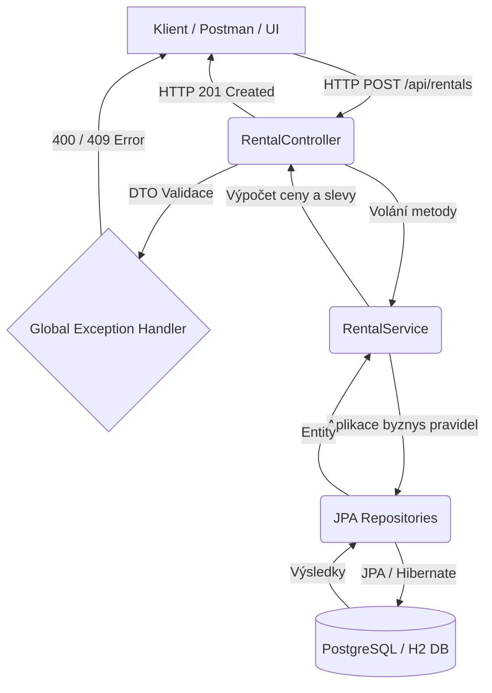

# Equipment Rental API (Půjčovna vybavení)

Tento projekt slouží jako spojená semestrální práce pro předměty **BTDD/KTDD (Test-Driven Development)** a **DevOps**.
Aplikace pokrývá kompletní životní cyklus vývoje softwaru: od návrhu domény řízeného testy (TDD), přes vrstvenou architekturu, až po plně automatizovanou CI/CD pipeline, kontejnerizaci a nasazení do Kubernetes clusteru.

---

##  Doména a Architektura (TDD)

### 1.1 Popis domény
Aplikace slouží jako backendový systém pro půjčovnu vybavení (např. stavební technika, nářadí). Zákazníci si mohou rezervovat dostupné vybavení na určité časové období. Systém hlídá dostupnost, počítá ceny a aplikuje slevy.

**Doménový model a vztahy (JPA):**
* `User` (Zákazník)
* `Equipment` (Vybavení k zapůjčení)
* `Rental` (Výpůjčka) – Spojovací entita (vztah N:1 k User i Equipment).

**5 implementovaných Business Pravidel:**
1. **Validace termínu:** Datum konce výpůjčky nesmí být před datem začátku.
2. **Kapacita a kolize:** Vybavení nelze půjčit, pokud se požadovaný termín překrývá s již existující výpůjčkou.
3. **Zákaznický limit:** Jeden uživatel smí mít maximálně 3 aktivní výpůjčky současně.
4. **Výpočet ceny:** Cena se počítá dynamicky na základě denní sazby vybavení a počtu dní.
5. **Množstevní sleva:** Pokud výpůjčka trvá 7 a více dní, aplikuje se automatická sleva 10 % z celkové ceny.

### 1.2 Architektura aplikace
Aplikace je postavena na frameworku **Spring Boot (Java 21)** a striktně dodržuje vrstvenou architekturu:
* **Controller Layer (REST API):** Validace vstupů (DTO objektů pomocí `@Valid`), srozumitelné HTTP kódy (`201 Created`, `400 Bad Request`, `409 Conflict`). Ošetření chyb centralizováno v `GlobalExceptionHandler`.
* **Service Layer:** Jádro business logiky. Vyvíjeno plně TDD přístupem.
* **Repository Layer:** Komunikace s databází přes Spring Data JPA (in-memory H2 pro testy, PostgreSQL pro produkci/staging).

### 1.3 Testovací strategie a TDD
Projekt byl vyvíjen iterativně pomocí TDD (cyklus Red-Green-Refactor), což je prokazatelné v historii Git repozitáře. Testy dodržují principy FIRST a strukturu AAA (Arrange-Act-Assert).

* **Unit testy:** Izolované testování `RentalService`. Externí závislosti (databázové repozitáře) jsou izolovány pomocí **Mockování** (Mockito), abychom mohli testovat hraniční stavy (např. překročení limitů) bez reálné databáze.
* **Integrační testy:** Ověřují průchod napříč všemi vrstvami. Používáme `TestRestTemplate` pro simulaci reálných HTTP požadavků. Databáze je před každým testem vyčištěna.
* **Data JPA testy:** Ověření mapování entit a custom queries přes `@DataJpaTest`.

Code Coverage (JaCoCo) :
Měření pokrytí kódu je zajištěno nástrojem JaCoCo. Vlastní cíl pokrytí byl realisticky stanoven na > 50 % celkového pokrytí instrukcí (Total Line) a > 60 % pokrytí logických větví (Branch). Tohoto cíle bylo úspěšně dosaženo (Total: 58 %, Branch: 68 %). Cílem nebylo nahánět 100 % za každou cenu na netriviálním kódu, ale pokrýt skutečnou byznys logiku.

Reálné výsledky:

* `service` (Instrukce: 68 %, Větve: 68 %): Zde probíhal hlavní vývoj pomocí TDD. Pokrytí logických větví ukazuje, že IF/ELSE podmínky (byznys pravidla) jsou kvalitně otestovány. Zbylá chybějící procenta tvoří okrajové a infrastrukturní výjimky (např. selhání komunikace s databází), které se v izolovaných Unit testech testují neefektivně.

* `dto` (Instrukce: 100 %): Datové přenosové objekty se podařilo plně pokrýt v rámci integračních testů Controlleru.

* `entity` (Instrukce: 30 %): Třídy obsahují primárně databázové anotace (JPA), gettery, settery a prázdné konstruktory. Tato vrstva postrádá vlastní byznys logiku a psaní testů pouze na "ověření getteru" je anti-pattern, který nepřináší žádnou hodnotu.

* `controller` (Instrukce: 59 %): REST API je pokryto přes TestRestTemplate. Testujeme "happy path" a hlavní chybové stavy (400, 409). Nepokryté řádky jsou specifické interní výjimky frameworku Spring, které zachytává na pozadí.

* Hlavní třída `EquipmentRentalApplication` (Instrukce: 37 %): Obsahuje pouze metodu public static void main. Spolehlivost tohoto startéru garantuje samotný framework Spring Boot a není třeba ho uměle testovat.
---

## DevOps, CI/CD a Infrastruktura

### 2.1 Git Workflow
* Vývoj probíhal ve smysluplných commitech (více než 20 commitů) dokumentujících TDD postup.
* Žádný "big-bang" na konci. Používáno větvení (`feature/*` branches) s následným slučováním přes Pull Requesty.

### 2.2 CI/CD Pipeline (GitHub Actions)
Pipeline (`.github/workflows/ci.yml`) se spouští při pushi nebo Pull Requestu do větve `master`. Je rozdělena na dva na sebe navazující joby.

**Fáze CI (Build & Test):**
1. Nastavení prostředí (Java 21) a zprovoznění testovacího kontejneru s PostgreSQL.
2. **Build & Test:** Spuštění Unit a Integračních testů (`mvnw clean verify`).
3. **Statická analýza:** Kontrola kvality kódu přes plugin PMD.
4. **Artefakty:** Nahrání Surefire test reportů a **JaCoCo Code Coverage reportu**.
5. **Kontejnerizace:** Sestavení Docker image z přiloženého `Dockerfile` a publikace do **GitHub Container Registry (GHCR)**.

**Fáze CD (Deployment):**
Nasazení je plně automatizované. Ke spuštění dochází až po úspěšném otestování kódu.
1. Vytvoření lokálního Kubernetes clusteru pomocí **KinD**.
2. Vytvoření logických prostředí pomocí namespaces (`staging` a `production`).
3. Bezpečné předání přístupových údajů k DB z GitHub Secrets do **Kubernetes Secrets**.
4. Nasazení PostgreSQL a aplikačních podů přes K8s manifesty.
5. Verifikace nasazení (čekání na status running).

### 2.3 Kontejnerizace a Docker
Aplikace obsahuje optimalizovaný `Dockerfile`:
* Využívá multi-stage build pro minimalizaci velikosti výsledného image (oddělení sestavení a běhového prostředí).
* Aplikace uvnitř kontejneru běží pod **non-root uživatelem** z bezpečnostních důvodů.
* Pro lokální vývoj je připraven `docker-compose.yml`, který spustí aplikaci spolu s PostgreSQL databází.

### 2.4 Kubernetes Manifesty a Prostředí
Všechny K8s manifesty jsou uloženy ve složce `k8s/`. Obsahují:
* **Deployment:** Specifikace nasazení aplikace vč. definice Resource limits/requests.
* **Service:** Zpřístupnění aplikace uvnitř clusteru.
* **ConfigMap:** Oddělení konfigurace (např. URL k databázi) od Docker image. Existuje rozdíl mezi `staging` a `production` namespace.
* **Secret:** Citlivá data (hesla) nejsou v gitu, plní se dynamicky v CI pipeline.

**Rozdíl prostředí:** Aplikace rozlišuje prostředí pomocí namespaces. `Staging` namespace slouží pro integrační otestování před reálným releasem, `Production` obsahuje finální stabilní verzi.

---

## Jak spustit projekt

### 3.1 Lokální spuštění (pro vývoj)
Pro lokální vývoj (s in-memory H2 databází) stačí mít nainstalovanou Javu 21.

Spuštění testů (Unit + Integrační + JaCoCo report):
```bash
./mvnw clean verify
```
Spuštění samotné aplikace:
```bash
./mvnw clean install
./mvnw spring-boot:run
```
### 3.2 Spuštění přes Docker Compose (kompletní stack s databází)
Pro otestování produkčnějšího sestavení, které spustí aplikaci společně s PostgreSQL databází v kontejnerech (vyžaduje běžící Docker Desktop):

1. Spuštění infrastruktury:
V terminálu v kořenové složce projektu spusťte příkaz:

```bash
docker-compose up --build -d
```
Aplikace se sestaví a spustí na pozadí na portu 8080.

2. Otestování API:
Jelikož se jedná o REST API (čekající na POST požadavek), prohlížeč nestačí. Pro vytvoření výpůjčky můžete použít nástroj Postman (nastavit metodu POST na http://localhost:8080/api/rentals s příslušným JSON tělem), nebo v PowerShellu spustit:

Příklad požadavku (PowerShell):
```bash
Invoke-RestMethod -Uri "http://localhost:8080/api/rentals" -Method Post -ContentType "application/json" -Body '{
    "userId": 1,
    "equipmentId": 1,
    "startDate": "2026-04-01",
    "endDate": "2026-04-05"
}'
```
3. Ukončení a úklid:
Pro vypnutí kontejnerů a smazání dočasných sítí použijte:

```Bash
docker-compose down
```